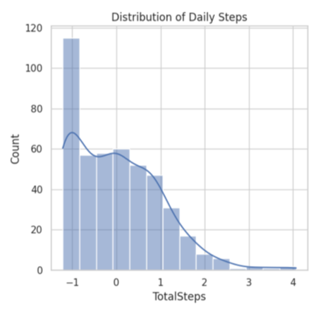
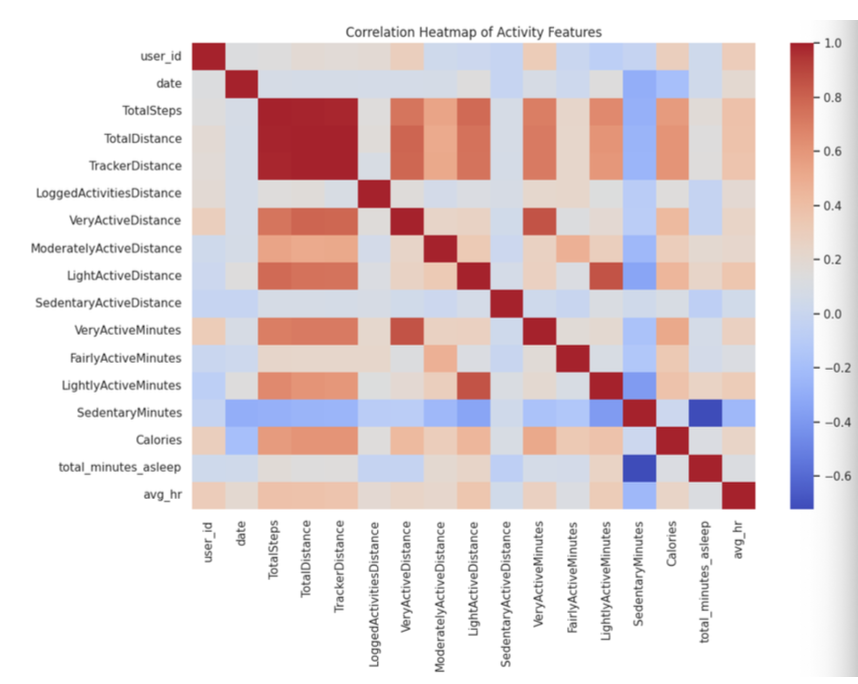
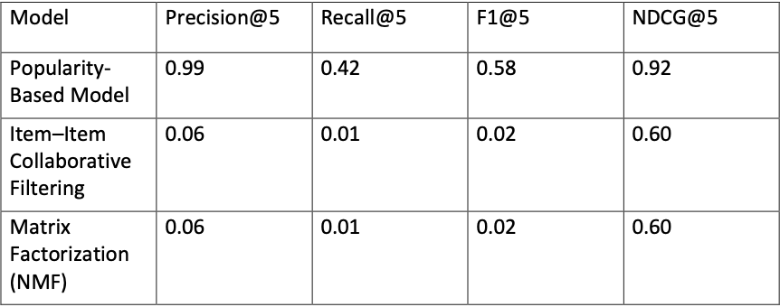

# 🧠 Health Recommendation System using Fitbit Data

🚀 A complete end-to-end data science project that builds a **personalized health and wellness recommendation system** using real-world Fitbit activity data.

---

## 📌 Project Highlights

* 🔄 End-to-end data science pipeline
* 📊 Real-world Fitbit dataset analysis
* 🤖 Recommendation system using implicit feedback
* 📈 Insight-driven health analytics

---

## 📖 Project Overview

This project develops a **personalized recommendation system** by analyzing user behavior from wearable device data, including:

* Daily physical activity
* Sleep patterns
* Heart rate trends

Unlike traditional systems that rely on ratings, this project uses **implicit feedback (user activity presence)** to model behavior and generate recommendations.

---

## 🎯 Problem Statement

Wearable devices generate large volumes of behavioral data, but lack explicit feedback.
The challenge is to:

> Predict user behavior and generate meaningful recommendations using only implicit signals.

---

## 🧩 Methodology

### 1. Data Integration

* Merged multiple Fitbit datasets into a unified structure
* Aggregated sleep and heart rate to daily level

### 2. Data Preprocessing

* Handled missing values using implicit feedback logic
* Standardized features for modeling

### 3. Exploratory Data Analysis

* Identified activity trends and behavior patterns
* Analyzed feature relationships and correlations

### 4. Recommendation Models

* Popularity-Based Model
* Item-Item Collaborative Filtering
* Matrix Factorization (NMF)

### 5. Model Evaluation

* Precision@5
* Recall@5
* F1 Score
* NDCG

---

## 📊 Key Results

### 📈 Daily Steps Distribution



### 🔥 Feature Correlation Heatmap



### 🏆 Model Performance Comparison



---

## 💡 Key Insights

* Strong correlation between steps, calories, and activity intensity
* User behavior patterns are relatively consistent across dataset
* Popularity-based recommendation model outperformed advanced models
* Data sparsity impacts personalization performance

---

## 🛠️ Tech Stack

* **Programming:** Python
* **Libraries:** Pandas, NumPy, Scikit-learn
* **Visualization:** Matplotlib
* **Environment:** Jupyter Notebook

---

## 📁 Repository Structure

```
health-recommendation-system-fitbit-data/
│
├── notebooks/
│   └── PROJ-1-DME.ipynb
│
├── data/
│   └── final_merge.csv
│
├── reports/
│   └── FINAL_REPORT.pdf
│
├── images/
│   └── project result images
│
└── README.md
```

---

## 📌 Portfolio Value

This project demonstrates:

* Data preprocessing & integration
* Exploratory data analysis
* Recommendation system design
* Evaluation of implicit-feedback models
* Clear and professional documentation

---

## 🌍 Real-World Impact

This system can be used to:

* Track and improve daily health habits
* Provide personalized activity recommendations
* Support preventive healthcare analytics

---

## 👨‍💻 Author

**Dev Patel**
Master’s Student – Data Analytics Engineering

---

⭐ If you found this project useful, consider giving it a star!
